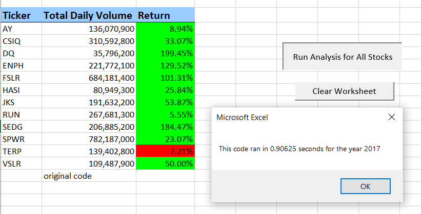
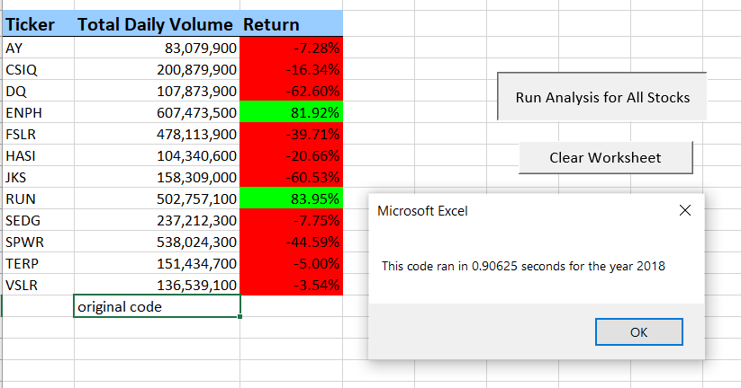
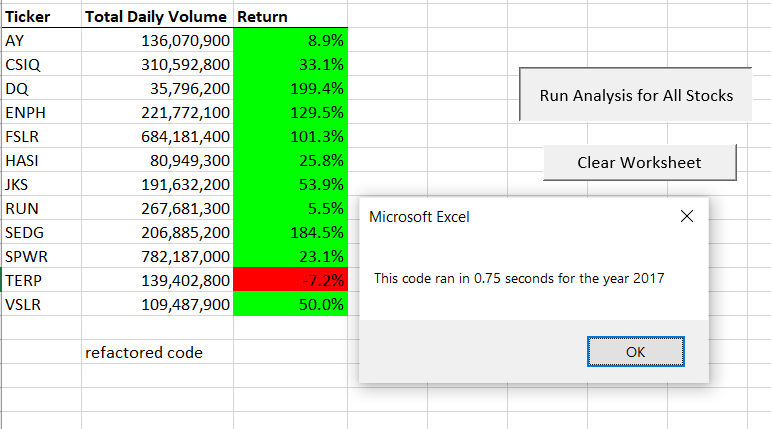
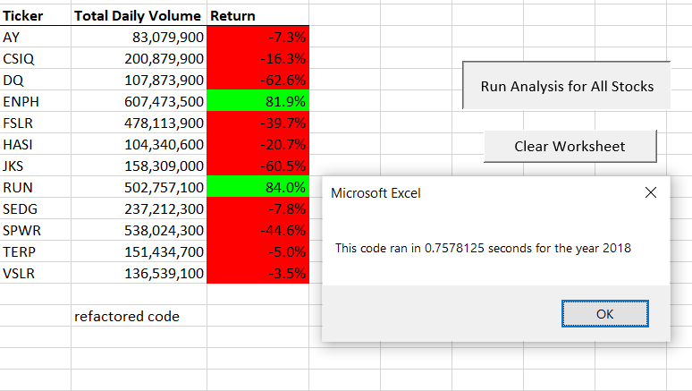

# stock-analysis

## Overview of Project

### Purpose

Our team was tasked with creating an analysis of stock data to explore various stocks in the data in the hopes of providing information about stocks that represent good investment options.  The specific request for our team was to analyze the data to construct 'an analysis of a variety of clean-energy stocks, including DAQO (DQ), to provide information for future investment decisions'.  Thus, our analysis will focus on DAQO but will also analyze other clean-energy stock options.

The data being analyzed consists of stock performance information for 12 different clean-energy stocks for the years 2017 (n=3012) and 2018 (n=3013). The data provided includes the opening, closing, high, and low prices for a given trading day as well as the adjusted closing price and the volume traded for that day. Using VBA, our team has produced an analysis of this data set to assess the performance of DAQO and 11 other clean-energy stocks. For these 12 stocks, our team focused the analysis on the total volume traded over the year (2017 or 2018) as well as the return (change in stock value) over that time period. Focusing on these categories helps inform the customer of which stocks are most active and the change in their prices over a one year period.

## Analysis and Challenges

The first attempt to analyze the data using VBA focused on each stock individually and functioned by scanning through the data set to find activity related to that stock ticker.  The macro constructed to conduct this analysis produced the following output for the year 2017.  This macro had a run time of 0.90625 seconds.  

The macro constructed to conduct the analysis produced the following output for the year 2018.  This macro also had a run time of 0.90625 seconds. 

The macro was then refactored to improve the efficiency of the code.  This refactoring focused on decreasing the run time for the code in order to accommodate potentially larger data sets of stock information for future analyses. Instead of scanning through the data one ticker at a time, the refactoring instead allowed a single scan through of the data and data for each ticker was collected simultaneously.  This refactored macro produced the following output for the year 2017.  This macro had a run time of 0.75 seconds.  

The refactored macro produced the following output for the year 2018.  This macro had a run time of 0.7578125 seconds.  
 

Now let's turn to interpreting these outputs to identify stocks that can be recommended to the customer as candidates for investment.  

### Analysis of DAQO

The analysis of the performance of DAQO stocks for 2017 and 2018 shows returns of 199.4% and -62.6% respectively.  The large fluctuation in return from one year to the next recommends a closer look at these stocks before investing in DAQO.
* The volume of DAQO stock traded in 2017 (approximately 36 million shares) is significantly less than the trading volume of the other clean energy stocks (mean = 264 million shares) that year.  So, while the price increase for 2017 is attractive, the low volume suggests the return may not represent an adequate assessment of the true value of the stock.  
* The volume of DAQO stock traded increased in 2018 (approximately 108 million shares) but is still significantly less than the trading volume of the other clean energy stocks (mean = 276 million shares) and, with this increased volume, we actually see a decrease in stock return (-62.6%).  This suggests the increase in trading activity could be more accurately representing the price of the stock (by decreasing it from an inflated value in 2017).  

### Analysis of Clean-Energy Stocks

The analysis of the performance of the other 11 clean energy stocks shows a few stocks that demonstrate large trading volumes and positive returns. One particular stock shows these factors consistently for both years: 
*  The volume of ENPH stock traded in 2017 (approximately 222 million shares) is close to the average volume of stock traded for these clean energy stocks for that year.  Additionally, ENPH saw a 129.5% return in price for that year.  
*  The volume of ENPH stock traded also increased in 2018 (approximately 607 million shares) and is significantly greater than the mean volume traded for these clean energy stocks for that year (mean = 276 million shares).  Importantly, for a second year in a row ENPH showed positive return (81.9%).  

These combinations of positive return and increasing volume year over year suggests ENPH can be recommended as a candidate for investment.

### Challenges and Difficulties Encountered

Challenges were experienced in refactoring the VBA code to increase the efficiency and run time of this macro.  Nested indices and loops contributed to greater efficiencies but required increased programming time and labor.  However, the usability of this macro for future analyses of larger data sets justified this expenditure.   

Additionally, if the customer is interested in focusing on DAQO stock, a more granular and longitudinal analysis of the performance of this stock and the company based on products, goals, company values, and business plans is recommended as the fluctuation between positive and negative returns and volume for this stock are highly variable.  With inconsistent data as DAQO is presenting, it is difficult to make a confident recommendation for investment or non-investment.

## Results & Recommendations

In summary, the analysis of the clean energy stock data showed DAQO as a fluctuating stock with inconsistent volumes consistently below the average trading volume of clean energy stocks.  This stock represents a possible risk as a consistent pattern of behavior has not been found.  It is recommended that an increased analysis be conducted beyond two years of data to allow for a more longitudinal analysis of stock price and volume performances in the clean energy sector.  Also, considerations of technological and economic factors impacting price and volume fluctuations should be included to inform interpretations of sector wide return and volume fluctuations. 

The analysis of this data produces the following recommendations to our customer for investing in clean energy stock:  
*DAQO stock appears unstable and is trading at a lower than average volume.  A recommendation for investment in DAQO cannot be made at this time.  The customer is advised to invest in stocks that show more volume and more consistent positive return, such as demonstrated in the behavior of the ENPH stock over 2017 and 2018. Further analysis as recommended above is suggested if greater evidence is required for investment decisions.*
